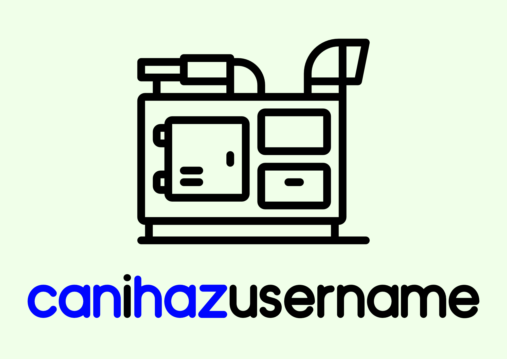

Username generator. Fully typed, simple and customizable. **0 Dependencies**

The lists are taken from [this repo](https://github.com/imsky/wordlists) and automatically converted into json by `./generate/wordlist.js`

## 🕹 [Interactive Demo](https://cupcakearmy.github.io/canihazusername/)

Small website where you can see it in action and customize the output.

https://cupcakearmy.github.io/canihazusername/

## 🏗 Install

```bash
yarn add canihazusername
```

## 🚀 Quickstart

```typescript
import { generate } from 'canihazusername'

const username = generate()
```

## 🎛 Customize

You can of course customize the generated username. The default format string is `{character}_{english}`.

```typescript
import { generate } from 'canihazusername'

const username = generate('something-{character}_bot')
```

Basically you can use any string you want and everything between `{somelist}` will be replaced from a random word from the list called `somelist`.

There is a [list of available words](#-lists) that you can use.

### ⛓ Combine multiple lists

You can also combine multiple (as many as you wish) lists into the same braket with the `|` charcter.
This will build a combined list and choose at random between all those words.

```typescript
import { generate } from 'canihazusername'

const username = generate('{quantity|age|cats|}')
```

This example will choose a random word between the `quantity`, `age` and `cats` list.

### ✒️ Use you own lists

You can also add your own lists or owerwrite the built in one.

```typescript
import { generate } from 'canihazusername'

const gits = ['gitlab', 'github', 'gitea']
const username = generate('{gits}', { lists: { gits } })
```

### 🔐 Reformats limit

For security reasons the default limit for the maximum reformats/insertions is set to 16.

If you use more than 16 `{}` you can increase them with the `maxReformats` option.

```typescript
import { generate } from 'canihazusername'

const username = generate('{1} {2} ... {17}', { maxReformats: 16 }) // ❌ The last one will not be replaced
const username = generate('{1} {2} ... {17}', { maxReformats: 20 }) // ✅
```

## 🗂 Lists

- age
- algorithms
- appearance
- character
- colors
- complexity
- construction
- corporate_prefixes
- emotions
- geometry
- linguistics
- materials
- music_theory
- physics
- quantity
- shape
- size
- sound
- speed
- taste
- temperature
- weather
- blockchain
- corporate
- hipster
- lorem
- reddit
- alpha
- canada
- city_states
- france
- netherlands
- switzerland
- united_states
- apple
- intel
- microsoft
- unicorns
- founders
- usa
- chicago
- newyork
- basque
- english
- french
- german
- irish
- italian
- scottish
- 3d_graphics
- 3d_printing
- accounting
- apex_predators
- architecture
- astronomy
- automobiles
- birds
- buildings
- car_parts
- cats
- cheese
- chemistry
- coding
- condiments
- containers
- corporate_job
- cotton
- data_structures
- design
- dogs
- driving
- fast_food
- filmmaking
- fish
- food
- fortifications
- fruit
- furniture
- gaming
- geography
- ghosts
- history
- houses
- infrastructure
- insurance
- linear_algebra
- machine_learning
- meat
- metals
- military_airforce
- military_army
- military_navy
- minerals
- music_instruments
- music_production
- phones
- physics_optics
- physics_units
- physics_waves
- plants
- radio
- real_estate
- screenwriting
- seasonings
- set_theory
- shopping
- spirits
- sports
- startups
- storage
- travel
- typography
- vcs
- water
- web_development
- wine
- wood
- writing
- art
- collection
- communication
- cooking
- creation
- destruction
- fire
- graphics
- look
- manipulation
- movement
- music
- programming
- thought
- web

## 🙏 Credits

- Wordlist https://github.com/imsky/wordlists
- Icons made by <a href="https://www.flaticon.com/authors/smashicons" title="Smashicons">Smashicons</a> from <a href="https://www.flaticon.com/" title="Flaticon"> www.flaticon.com</a>
